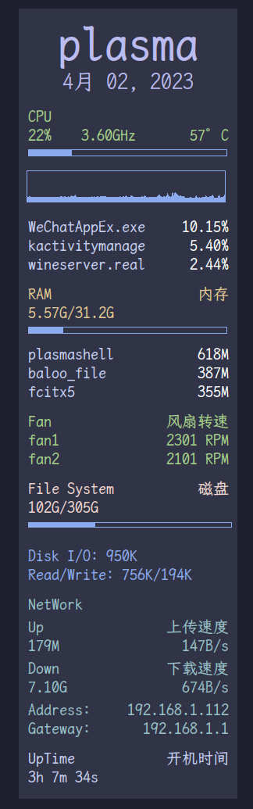

# Conky Configuration

## 效果预览图



## 操作步骤

### 一、下载Conky

#### Arch系

```bash
sudo pacman -S conky
```

这一步是为了安装Conky

```bash
conky -C > ~/.config/conky/conky.conf
```

这一步是为了将Conky的默认配置定向并生成于~/.config/conky/目录下

---

### 二、克隆文件

下载好后，将conky.conf 移至 ~/.config/conky/下，（记得将原来的做备份)

```bash
mv ~/.config/conky/conky.conf ~/.config/conky/conky.conf.bak
git clone https://github.com/xjimlinx/Conky_configs.git
cd Conky_configs
cp ./conky.conf ~/.config/conky/conky.conf
```
